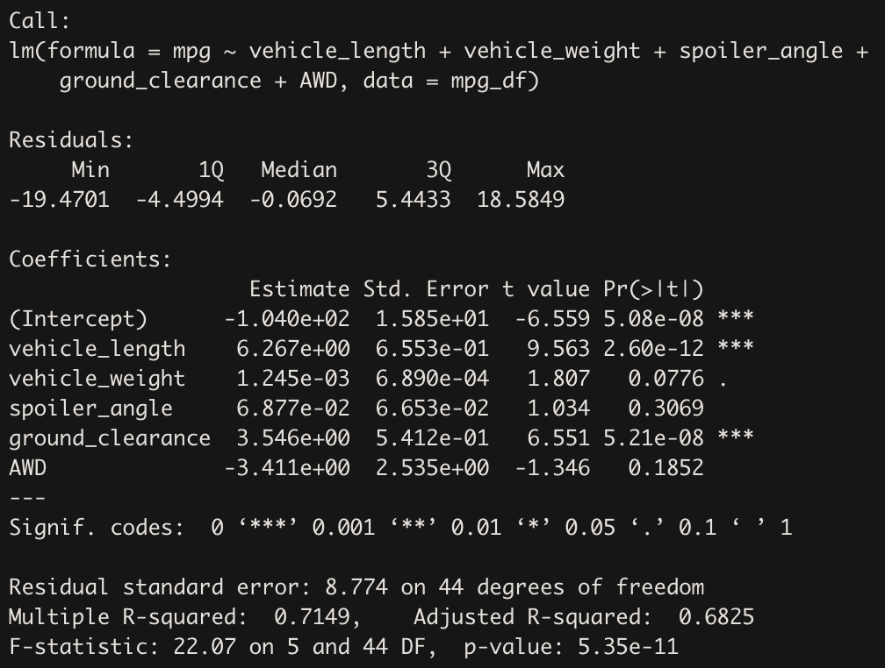
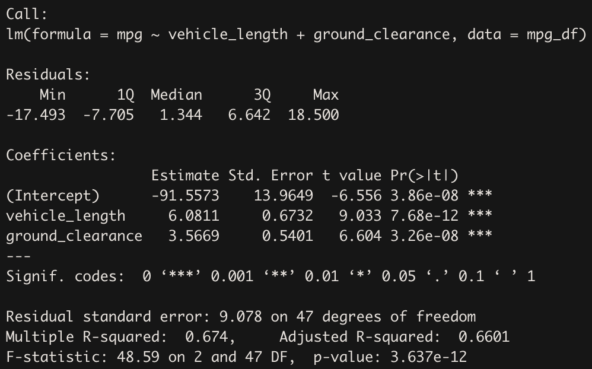
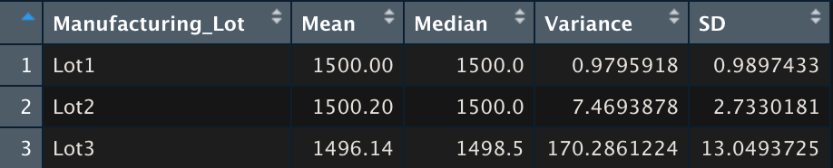

# Mecha Car with R

***University of Toronto - Data Analytics Boot Camp - Module 16 - Statistics and R***

---

## Part 1: Linear Regression to Predict MPG

Linear Regression model to predict MPG based on Vehicle Length, Vehicle Weight, Spoiler Angle, Ground Clearance, AWD has been created and the results are illustrated in the below picture.

  * ***R-Squared: 0.71***, this means the model can predict an acceptable portion of MPG data points based on the independent variables that takedn into consideration.
  * ***P-value: Almost 0***, means H0 is rejected and at least one of the variables slope is not zero.
  * Vehicle Weight, Spoiler Angle, and AWD are not statistically significant and can be neglected in next model.
  
  Linear Regression model to predict MPG based on Vehicle Length, Ground Clearance, has been created and the results are illustrated in the below picture.

  * ***R-Squared: 0.67***, this means new model has lost 4% of its predition capability after taking out 3 variables. Awesome!
  * ***P-value: Almost 0***, means H0 is rejected and at least one of the variables slope is not zero.
  * In new model, we have two highly significant independent variables. Thus we can predict 67% of MPG datapoints based on Vehichle Length and Ground Clearance.
  
  ---
  
###The Regression Line Equation 
***MPG = 6.08 * vehicle_length  +  3.57 * ground_clearance - 91.56***
  
  ---
  
### Questions

1. Which variables/coefficients provided a non-random amount of variance to the mpg values in the dataset?
  Vehicle length and Ground clearance
  
2. Is the slope of the linear model considered to be zero? Why or why not?
  No, the slope of aforementioned independent variables is not zero because the H0 is rejected due to almost zero P-value.

3. Does this linear model predict mpg of MechaCar prototypes effectively? Why or why not?
  Yes, almost 67% of the MPG data points can be predicted by the two variables. (R-squared = 0.67)

---

## Part 2: Create Visualizations for the Trip Analysis

###Total summary

---

###Lot summary (Data is groupd by Manufacturer Lot)

---

Mean and median are almost the same in total and for each lot. However, the variance should not exceed 100. based on this criterion, we are doing great in total but the Lot3 should take some measure into consideration to recuce the variance since it is 70% more than the treshold.

---

## Part 3: T-Tests on Suspension Coils

