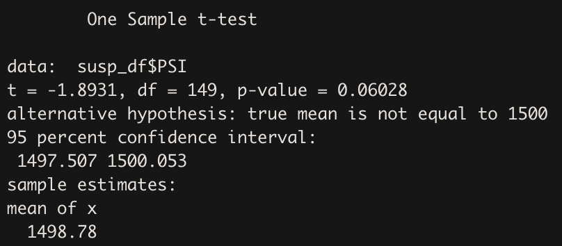
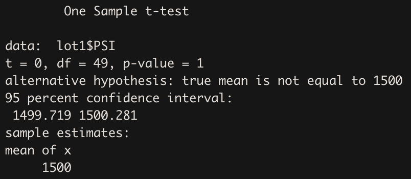
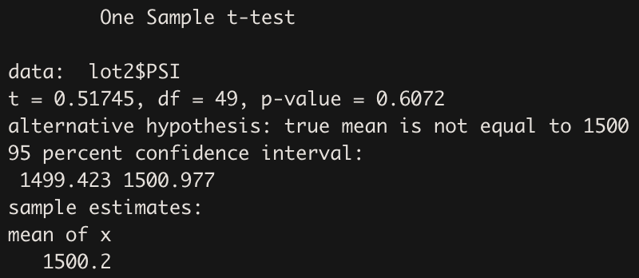
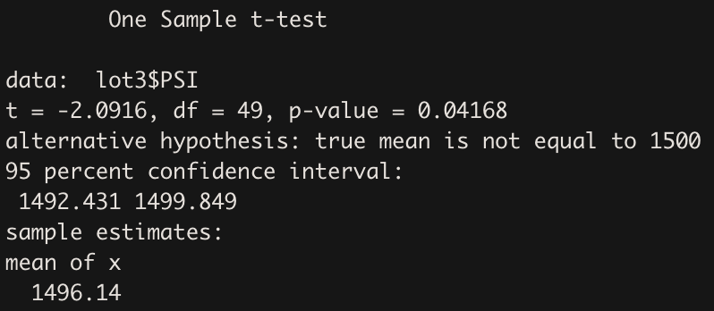

# Mecha Car with R

***University of Toronto - Data Analytics Boot Camp - Module 16 - Statistics and R***

---

## Part 1: Linear Regression to Predict MPG

Linear Regression model to predict MPG based on Vehicle Length, Vehicle Weight, Spoiler Angle, Ground Clearance, AWD has been created and the results are illustrated in the below picture.

  * ***R-Squared: 0.71***, this means the model can predict an acceptable portion of MPG data points based on the independent variables that takedn into consideration.
  * ***P-value: Almost 0***, means H0 is rejected and at least one of the variables slope is not zero.
  * Vehicle Weight, Spoiler Angle, and AWD are not statistically significant and can be neglected in next model.
  
  Linear Regression model to predict MPG based on Vehicle Length, Ground Clearance, has been created and the results are illustrated in the below picture.

  * ***R-Squared: 0.67***, this means new model has lost 4% of its predition capability after taking out 3 variables. Awesome!
  * ***P-value: Almost 0***, means H0 is rejected and at least one of the variables slope is not zero.
  * In new model, we have two highly significant independent variables. Thus we can predict 67% of MPG datapoints based on Vehichle Length and Ground Clearance.
  
  ---
  
### The Regression Line Equation

***MPG = 6.08 * vehicle_length  +  3.57 * ground_clearance - 91.56***
  
  ---
  
### Questions

1. Which variables/coefficients provided a non-random amount of variance to the mpg values in the dataset?
  Vehicle length and Ground clearance
  
2. Is the slope of the linear model considered to be zero? Why or why not?
  No, the slope of aforementioned independent variables is not zero because the H0 is rejected due to almost zero P-value.

3. Does this linear model predict mpg of MechaCar prototypes effectively? Why or why not?
  Yes, almost 67% of the MPG data points can be predicted by the two variables. (R-squared = 0.67)

---

## Part 2: Create Visualizations for the Trip Analysis

### Total summary

---

### Lot summary (Data is groupd by Manufacturer Lot)

---

Mean and median are almost the same in total and for each lot. However, the variance should not exceed 100. based on this criterion, we are doing great in total but the Lot3 should take some measure into consideration to recuce the variance since it is 70% more than the treshold.

---

## Part 3: T-Tests on Suspension Coils

In this part four different t-tests has been executed and the result are as below.
H0: There is no difference between the mean of data and population mean.
Alpha is 0.05.

---

 1. T-test to see if there is a statistical difference between mean of the whole dataset (All manufacturer) and 1500 as the mean of population?

As illustrated, the **P-value is 0.06**, Thus there is not enough evidence to reject H0. Therefore, ***there is no statistical difference between the whole sample's mean and the population mean***.

---

 2. T-test to see if there is a statistical difference between mean of the subset including only Lot1 data and 1500 as the mean of population?

As illustrated, the **P-value is 1**, Thus there is not enough evidence to reject H0. Therefore, ***there is no statistical difference between the Lot1 sample subset's mean and the population mean***.

 3. T-test to see if there is a statistical difference between mean of the subset including only Lot2 data and 1500 as the mean of population?

As illustrated, the **P-value is 0.61**, Thus there is not enough evidence to reject H0. Therefore, ***there is no statistical difference between the Lot2 sample subset's mean and the population mean***.

 4. T-test to see if there is a statistical difference between mean of the subset including only Lot3 data and 1500 as the mean of population?

As illustrated, the **P-value is 0.42**, Thus H0 is rejected. Therefore, ***there is statistical difference between the Lot3 sample subset's mean and the population mean***.

---

## Part 4: Design a Study Comparing the MechaCar to the Competition

The goal of this study is customer interest, therefore we can focus on criteria which are more important to customers not Mechanic experts.
I would focus my study on 3 different aspects; cost, safety, performance. I would explain the process for the first one in detail and for other two aspects in a more general approach.

### Cost
This part include two different cost; Vehicle cost, maintenance cost. Here I choose to take into consideration a total cost of vehicle purchase and maintenance for 5 years and call it **Cost**

Steps of the study:
 1. Collect market information including different manufacturers' vehicle and maintenance cost.
 2. Since cost is a numeric value, and we want to compare the mean cost of our products with the market mean, we can use one-sample t-test. The sample is the portfolio of our products, and the population is the vehicle market. We wish to offer more affordable options to our costumer so the H0 should be ***Our products Cost mean is not less than markets Cost mean.***. Thus the test is a one-way test.
 3. We select our alpha. Here we can use the normal 0.05 as alpha.
 4. We should run the test and extract p-value.
 5. We need to compare the p-value with the alpha. The outcome and interpretation is like this:
    * if P-value < 0.05, then H0 is rejected, and we can conclude ***With 95% confidence, our products cost less than market average.***
    * if P-value > 0.05, then there is not enough evidence to reject H0. Maybe with a higher alpha (lower confidence level) we can reject H0.

#### Sum up
 * What metric or metrics are you going to test?  
Cost: Vehicle cost + Maintenance cost for 5 years
 * What is the null hypothesis or alternative hypothesis?  
H0: Our products Cost mean is not less than markets Cost mean
 * What statistical test would you use to test the hypothesis? And why?  
one-sample t-test, with 0.05 as alpha and one-way test.
 * What data is needed to run the statistical test?  
We need below data for our products and other manufacturer products:
Manufacturer, Vehicle Name (Optional), Vehicle Type (Optional), Vehicle Cost, Maintenance Cost for first 5 years.

### Safety
We have to take some safety standard score into consideration. These scores can be numeric values in scale of 0-5 stars and if the scale is different, they can be converted. These scores should be collected for our vehicles and other manufacturers' vehicles.
Again we have to use t-test to compare our score mean and market score mean.

### Performance
For performance, we can use the different best practices since it can be a vast field to study. For example, by performance we might mean 0-100km time, maneuverability, braking performance, etc.
